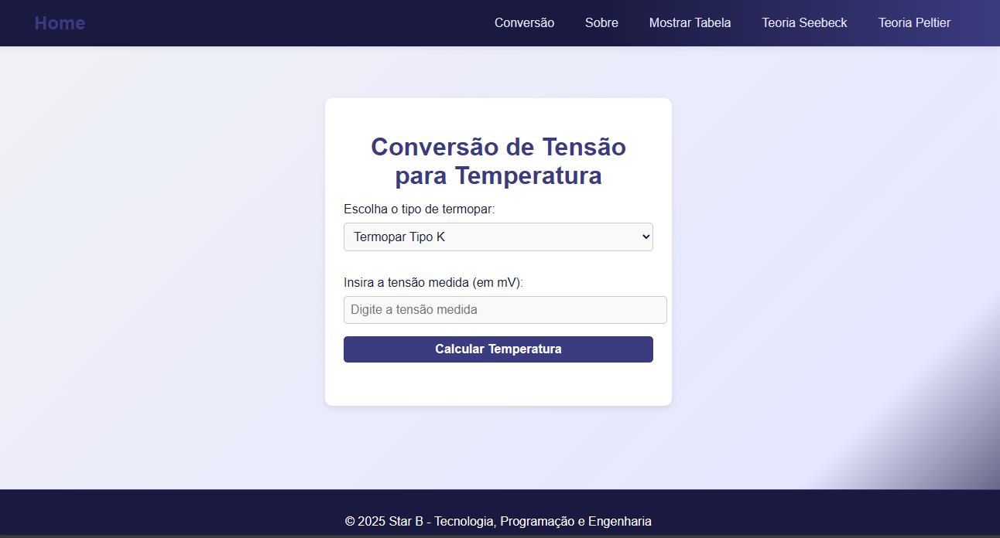

# Conversor de Tensão para Temperatura com Termopares

Este projeto web permite converter valores de tensão (mV) em temperatura (°C) para diferentes tipos de termopares (K, J, T, E), além de apresentar conteúdos educativos sobre os efeitos Seebeck e Peltier.

## Funcionalidades

- Conversão de tensão para temperatura usando tabelas de referência e interpolação linear.
- Visualização das tabelas de conversão para cada tipo de termopar.
- Painel lateral com explicação sobre o funcionamento do sistema.
- Conteúdo educativo sobre os efeitos Seebeck e Peltier, com gráficos interativos.
- Layout responsivo e visual moderno, feito com CSS puro.

## Tecnologias Utilizadas

- HTML5
- CSS3 (sem frameworks)
- JavaScript puro
- [Chart.js](https://www.chartjs.org/) para gráficos interativos

## Como usar

1. Clone ou baixe este repositório.
2. Abra o arquivo `index.html` em seu navegador.
3. Escolha o tipo de termopar, insira a tensão medida e clique em "Calcular Temperatura".
4. Use os botões do menu para acessar as tabelas, explicações ou conteúdos teóricos.

## Estrutura dos arquivos

- `index.html` — Conversor principal e painel lateral.
- `seebeck.html` — Teoria do efeito Seebeck.
- `peltier.html` — Teoria do efeito Peltier.
- `style.css` — Estilos globais do sistema.
- `scrypt.js` — Lógica de conversão e controle dos painéis.
- `README.md` — Este arquivo.

## Demonstração

Acesse a versão online:  
https://edineladelso.github.io/temperaturaTensaoTermopares/

## Autor

Edinel Mario Adelso  
Email: marenguae@gmail.com  
WhatsApp: +258878690250  
GitHub: [edineladelso](https://github.com/edineladelso/)

---

Projeto Edinel Mario Adelso - Tecnologia, Programação e Engenharia
